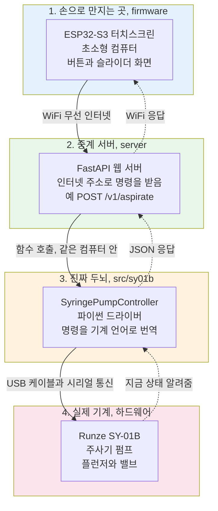
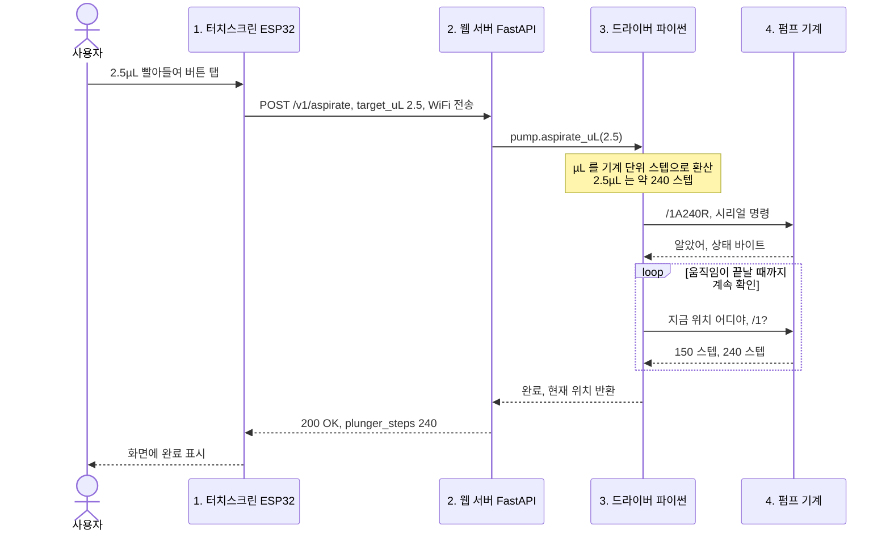
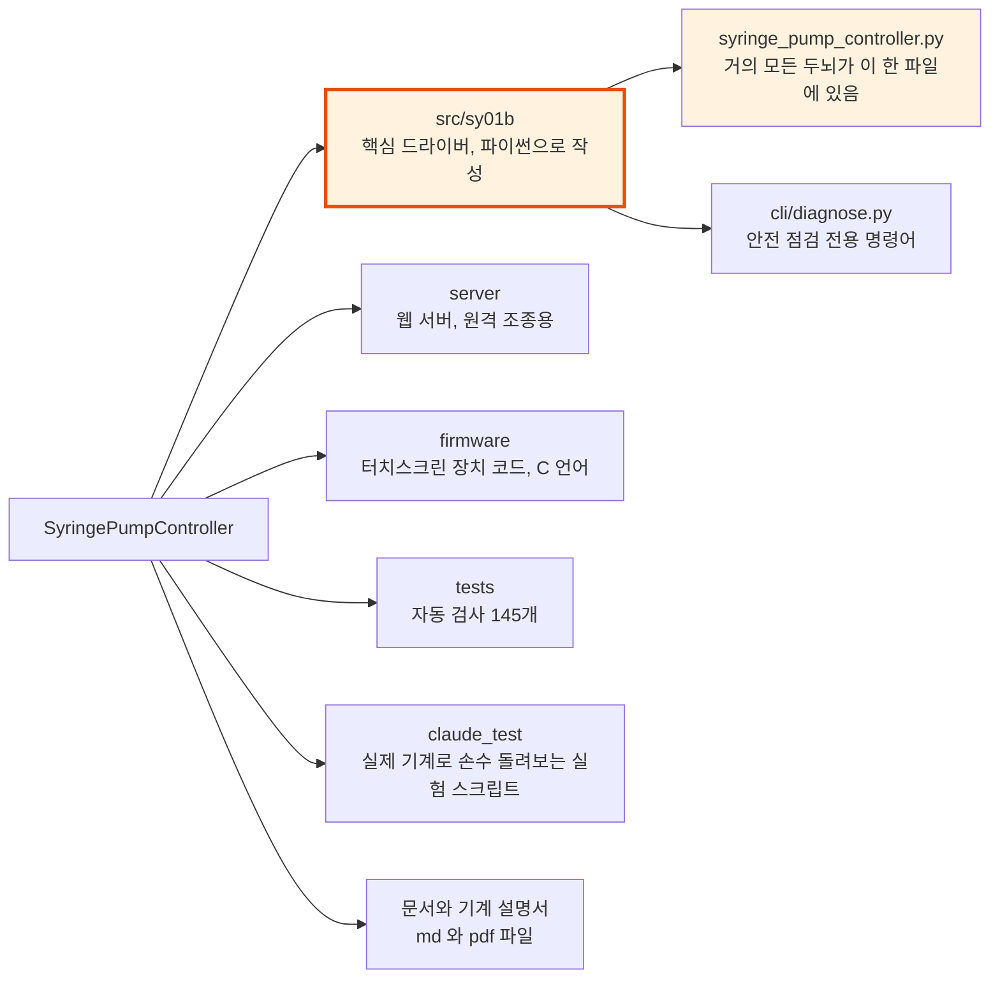
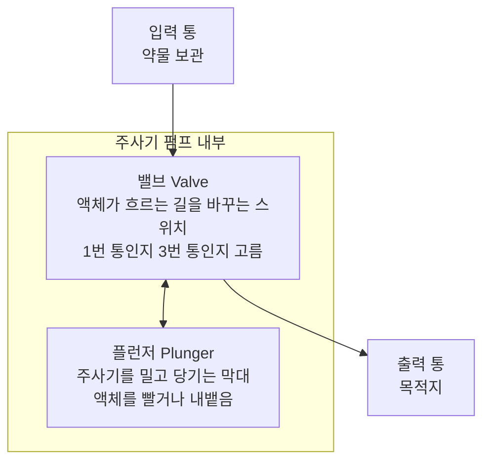
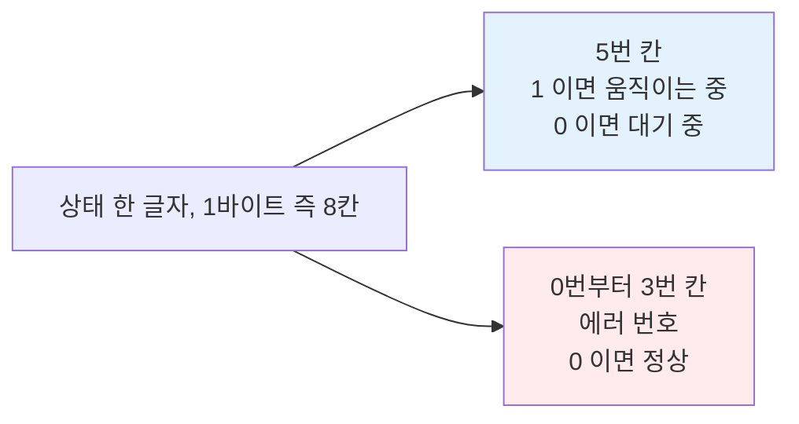
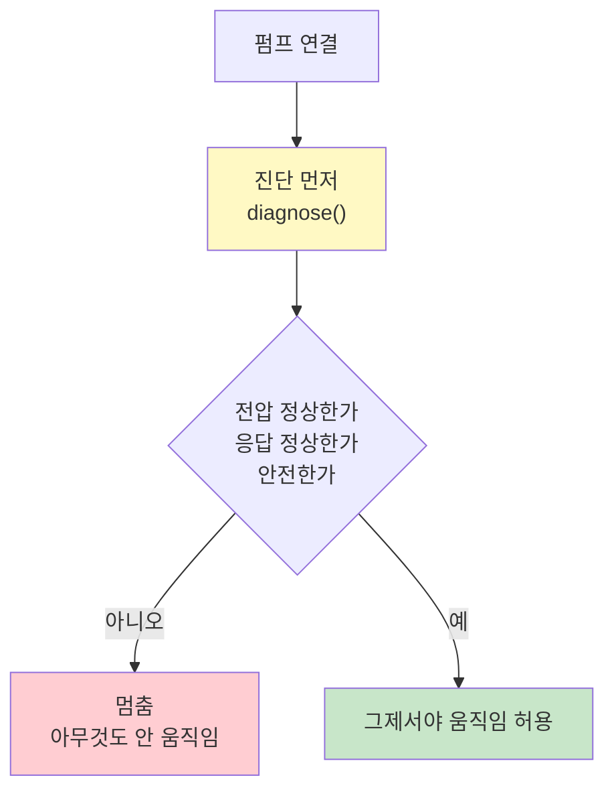
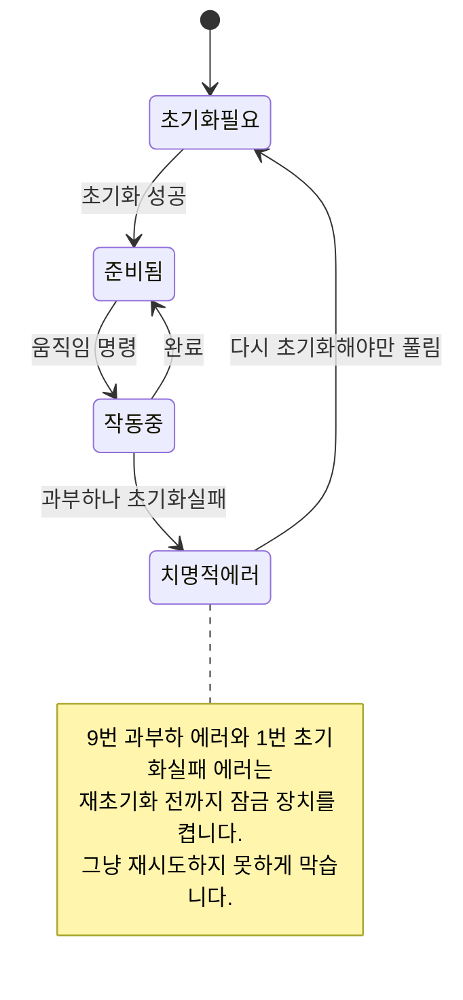
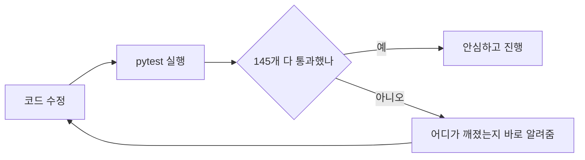
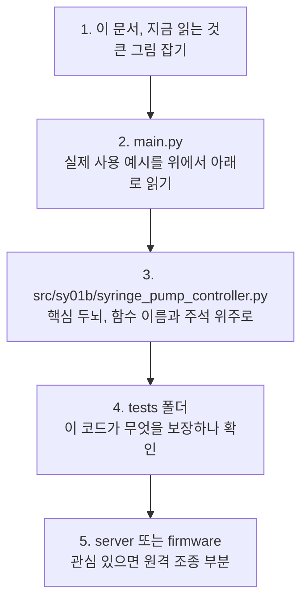

# 이 프로젝트, 처음 보는 사람을 위한 안내서

> **누구를 위한 문서인가요?**
> 파이썬이나 소프트웨어 개발을 잘 모르는 친구가 이 저장소를 **코드 리뷰**하기 전에,
> 이게 도대체 무엇을 하는 물건이고 코드가 어떻게 짜여 있는지 큰 그림을 잡도록 돕는 문서입니다.
> 전문 용어는 최대한 풀어서 쓰고 그림을 많이 넣었습니다.
>
> 더 깊은 기술 문서는 사용법을 담은 [README.md](README.md), 설계 의도를 담은 [DESIGN.md](DESIGN.md),
> 하드웨어와 통신 규격을 담은 [CLAUDE.md](CLAUDE.md) 에 있습니다. 이 문서는 그 앞에 두는 입문편입니다.

---

## 한 문장 요약

> **주사기 펌프라는 정밀 기계에게 얼마만큼 빨아들이고 얼마만큼 내뱉어라 하고 명령하는 소프트웨어**입니다.

연구실에서 약물과 시약을 마이크로리터 단위, 즉 100만분의 1리터인 µL 단위로 정확히 옮기는
[Runze SY-01B](CLAUDE.md) 라는 기계가 있습니다. 이 프로젝트는 그 기계를
컴퓨터와 작은 터치스크린 장치로 **자동 조종**하기 위한 코드 묶음입니다.

비유하자면 이렇습니다.

| 현실 세계 | 이 프로젝트 |
|---|---|
| 손으로 주사기를 밀고 당기는 연구원 | 코드가 대신 함, 정밀하고 반복 가능 |
| 3번 통에서 2.5µL 빨아 1번 통에 넣어줘 라는 지시 | 함수 호출 `aspirate_uL(...)` 한 줄 |
| 사람이 눈으로 눈금 확인 | 코드가 기계에 지금 위치를 계속 물어봄 |

---

## 1. 큰 그림, 무엇이 무엇과 연결되어 있나

이 시스템은 **4개의 층** 으로 되어 있습니다.
맨 위는 사람이 만지는 화면, 맨 아래는 실제 약물을 움직이는 기계입니다.



**핵심.** 명령은 위에서 아래로 내려가고 결과와 상태는 아래에서 위로 점선을 따라 올라옵니다.
각 층은 바로 아래 층하고만 대화합니다. 그래서 한 층을 통째로 바꿔도 나머지가 안 망가집니다.

> 코드 리뷰 팁. 사실 이 프로젝트의 심장은 3번 층인 [src/sy01b/](src/sy01b/) 입니다.
> 1번, 2번, 4번이 없어도 3번만으로 펌프를 조종할 수 있습니다.
> 1번과 2번은 원격으로 편하게 쓰자고 나중에 덧붙인 부분입니다.

---

## 2. 손가락 터치 한 번이 약물을 움직이기까지

친구가 화면에서 2.5µL 빨아들이기 버튼을 누르면 무슨 일이 벌어지는지,
시간 순서대로 그린 그림입니다.



**여기서 눈여겨볼 점.**

- 드라이버는 명령을 보낸 뒤 **다 됐어 하고 반복해서 물어봅니다.** 위 그림의 loop 부분입니다.
  기계가 천천히 움직이기 때문에, 다 끝날 때까지 기다렸다가 다음 명령을 보내야 사고가 안 납니다.
- 사람은 2.5µL 라고 말하지만 기계는 µL 를 모릅니다. **스텝** 이라는 단위만 압니다.
  드라이버가 중간에서 단위를 번역해 줍니다.

---

## 3. 저장소 지도, 어느 폴더에 무엇이 있나



표로 다시 정리하면 이렇습니다.

| 폴더 또는 파일 | 무슨 일을 하나 | 코드 리뷰 우선순위 |
|---|---|---|
| [src/sy01b/syringe_pump_controller.py](src/sy01b/syringe_pump_controller.py) | **이 프로젝트의 심장.** 기계와 대화하는 모든 핵심 로직, 약 1,000줄 | 가장 먼저 |
| [src/sy01b/cli/diagnose.py](src/sy01b/cli/diagnose.py) | 터미널에서 안전 점검만 실행하는 명령어 | 그다음 |
| [server/](server/) | 웹 주소로 명령을 받는 중계 서버, FastAPI | 그다음 |
| [firmware/](firmware/) | 터치스크린 장치 ESP32 안에서 도는 C 코드 | 여유 될 때, C 언어라 별도 |
| [tests/](tests/) | 코드가 망가졌는지 자동으로 검사하는 145개 시험 | 그다음 |
| [claude_test/](claude_test/) | 진짜 펌프에 연결해 사람이 직접 돌려보는 실험용 스크립트 | 여유 될 때 |
| [main.py](main.py) | 모든 기능을 순서대로 보여주는 튜토리얼 실행 파일 | 읽기 좋음, 추천 |

> 헷갈리기 쉬운 점. `tests/` 와 `claude_test/` 는 둘 다 테스트처럼 보이지만 다릅니다.
> `tests/` 는 **기계 없이도** 컴퓨터 혼자 자동으로 도는 검사입니다. 코드 논리가 맞는지 확인합니다.
> `claude_test/` 는 **진짜 펌프를 연결해야** 돌아가는 실험입니다. 실제 약물이 움직입니다.

---

## 4. 핵심 부품 자세히 보기

### 4.1 기계는 어떻게 생겼나, 플런저와 밸브

주사기 펌프에는 움직이는 부품이 딱 두 개입니다.



- **플런저.** 위아래로 움직여 액체를 빨아들이고 내뱉습니다. 빨아들이는 동작을 영어로 aspirate,
  내뱉는 동작을 dispense 라고 합니다. 위치는 0 부터 12,000 스텝 사이의 숫자로 표현됩니다.
  0 이면 텅 빈 상태, 12000 이면 가득 찬 상태입니다.
- **밸브.** 여러 개의 관 중 어디로 액체를 통하게 할지 고르는 회전 스위치입니다.

### 4.2 사람의 말에서 기계의 말로, 단위 번역


계산식은 단순합니다. 드라이버 안의 `_uL_to_steps` 가 처리합니다.

```
스텝 = 원하는 부피 µL 나누기 주사기 전체 부피 µL 곱하기 전체 스텝 수
```

예를 들어 125µL 주사기에서 2.5µL 는 `2.5 ÷ 125 × 12000 = 240 스텝` 입니다.

### 4.3 기계와 대화하는 언어, DT ASCII

드라이버와 펌프는 USB 케이블을 통해 짧은 글자 메시지를 주고받습니다.
사람의 문장처럼 정해진 형식이 있습니다.

**컴퓨터에서 펌프로 보내는 명령**

```
   /        1          A240         R          CR
  시작      주소      240으로 가     실행해      끝, 줄바꿈
```

- `/` 는 지금부터 명령이야 라는 시작 표시입니다.
- `1` 은 몇 번 펌프에게 하는 말인지 가리킵니다. 여러 대를 연결할 수 있습니다.
- `A240` 은 실제 명령으로, 플런저를 240 스텝 위치로 라는 뜻입니다.
- `R` 은 실행 단추입니다. 이게 붙어야만 기계가 진짜로 움직입니다.
  안 붙이면 그냥 메모만 해두고 기다립니다. 이것이 안전장치의 핵심입니다.
- `CR` 은 한 줄의 끝을 알리는 줄바꿈입니다.

**펌프에서 컴퓨터로 보내는 응답**

```
   /     0      상태      데이터       ETX     CR  LF
  시작   호스트   한 글자    답 내용      끝       끝
```

여기서 상태 한 글자가 아주 중요합니다. 이 한 글자 안에
지금 바쁜가 와 에러 났나 가 같이 들어 있습니다.



### 4.4 에러가 나면, 에러 번호와 대응

펌프는 문제가 생기면 번호로 알려줍니다. 드라이버는 번호마다 다른 예외 객체로 바꿔서
프로그램이 적절히 대응하게 합니다.

| 번호 | 무슨 뜻 | 어떻게 회복하나 |
|---|---|---|
| 0 | 정상 | 없음 |
| 1 | 초기화 실패 | 막힌 곳 뚫고 **다시 초기화 필수** |
| 7 | 아직 초기화 안 함 | 먼저 초기화 `initialize` 실행 |
| 9 | 플런저 과부하, 압력 너무 셈 | **반드시 다시 초기화** |
| 10 | 밸브 과부하 | 다음 밸브 명령이 자동 복구 시도 |
| 11 | 밸브가 막혀서 플런저 못 움직임 | 밸브를 다른 위치로 먼저 |
| 15 | 명령 너무 빨리 보냄 | 끝날 때까지 기다리기 |

---

## 5. 가장 중요한 안전 철학

이 프로젝트가 계속 강조하는 규칙 두 가지가 있습니다. 코드 곳곳에 박혀 있습니다.

### 규칙 1. 움직이기 전에 먼저 진단하라



`diagnose()` 는 **절대로 기계를 움직이지 않는** 건강검진입니다.
전압과 연결과 신원만 확인합니다. 실수로라도 움직이는 명령인 `R`, `Z`, `Y`, `W` 를
보내지 않도록 **테스트로 강제**하고 있습니다.

### 규칙 2. 진짜 기계로는 읽기만 한다

자동 테스트와 진단 도구는 실제 펌프에 **명령을 내리지 않고 상태만 읽습니다.**
실제로 약물을 움직이는 건 사람이 지켜보는 실험에서만 합니다.

> 이 두 규칙 덕분에, 코드를 잘못 짜도 **값비싼 기계나 시약이 망가질 위험**이 크게 줄어듭니다.

---

## 6. 펌프의 상태 기계, firmware 화면 쪽

터치스크린 장치는 펌프가 지금 어떤 상태인지 추적해서,
위험한 순간에는 **버튼을 잠가** 둡니다.



- **초기화필요**, 코드명 `NEEDS_INIT`. 전원 켠 직후이고 아직 기준점을 못 잡은 상태입니다.
- **준비됨**, 코드명 `READY`. 명령 받을 준비가 끝난 상태입니다.
- **작동중**, 코드명 `BUSY`. 움직이는 중이라 다른 명령을 못 받습니다.
- **치명적에러**, 코드명 `ERROR_FATAL`. 위험한 상태로, 다시 초기화하기 전엔 움직임을 전부 차단합니다.

> 실제 펌웨어에는 부팅, WiFi 연결, 복구 가능한 에러 같은 상태가 몇 개 더 있습니다.
> 여기서는 움직임을 막느냐 마느냐 라는 핵심만 단순하게 그렸습니다.
> 자세한 내용은 [firmware/main/state.h](firmware/main/state.h) 에 있습니다.

---

## 7. 자동 테스트는 왜 145개나 되나

좋은 코드의 신호 중 하나는 검사가 많다는 것입니다.
이 프로젝트는 코드를 고칠 때마다 145개의 자동 검사를 1초 안에 돌려서
내가 다른 데를 망가뜨리지 않았나 를 확인합니다.



검사 종류 예시는 이렇습니다.

- 명령 글자를 올바르게 조립하나. 예를 들어 `/1A240R` 같은 형식.
- 응답을 제대로 해석하나.
- 진단 도구가 **절대 움직임 명령을 안 보내는가.** 안전 규칙을 자동으로 감시합니다.
- 잘못된 입력, 예를 들어 범위 밖 부피에 제대로 거부하나.

---

## 8. 친구를 위한 코드 리뷰 순서 추천

처음 보는 사람이라면 이 순서로 읽으면 가장 이해가 빠릅니다.



리뷰할 때 던지면 좋은 질문들입니다.

- 이 함수 이름만 봐도 무슨 일을 하는지 알겠는가. 예를 들어 `aspirate_uL`, `diagnose`, `move_valve_to_port`.
- 위험한 동작인 움직임 전에 안전 점검이 있는가.
- 에러가 났을 때 그냥 멈추지 않고, 무엇이 잘못됐는지 알려주는가.
- 주석이 왜 이렇게 했는지를 설명하는가. 이 저장소는 주석이 매우 풍부합니다.

---

## 9. 용어 사전

| 용어 | 쉬운 설명 |
|---|---|
| **드라이버, driver** | 컴퓨터가 특정 기계와 대화하게 해주는 통역 소프트웨어 |
| **시리얼 통신, serial** | USB 케이블로 글자를 한 줄씩 주고받는 옛날부터 쓰는 통신 방식 |
| **플런저, plunger** | 주사기를 밀고 당기는 막대 |
| **밸브, valve** | 액체 흐름의 방향을 바꾸는 회전 스위치 |
| **µL, 마이크로리터** | 100만분의 1리터. 물 한 방울이 약 50µL |
| **스텝, step** | 모터가 움직이는 최소 단위. 펌프는 µL 대신 스텝으로 생각함 |
| **초기화, initialize** | 기계가 기준점인 0 위치를 다시 잡는 과정. 켜면 제일 먼저 함 |
| **진단, diagnose** | 기계를 움직이지 않고 상태만 확인하는 건강검진 |
| **FastAPI, 서버** | 인터넷 주소로 명령을 받아주는 프로그램 |
| **ESP32-S3, 펌웨어** | 손바닥만 한 터치스크린 컴퓨터와 그 안의 코드 |
| **테스트, pytest** | 코드가 잘 도는지 자동으로 확인하는 검사 도구 |
| **예외, exception** | 문제 발생을 알리는 프로그램의 비상벨 |

---

## 마치며

이 프로젝트의 인상을 한마디로 정리하면 이렇습니다.

> **비싸고 위험할 수 있는 정밀 기계를, 안전장치를 겹겹이 두고 조심스럽게 조종하는 코드.**

그래서 코드 곳곳에 움직이기 전에 확인, 읽기만 하기, 에러는 구체적으로 알리기 같은
**조심성**이 배어 있습니다. 리뷰할 때 그 조심성이 잘 지켜지는지 봐 주시면 좋습니다.
